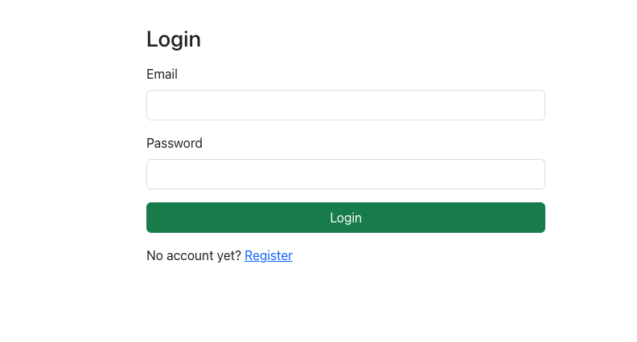
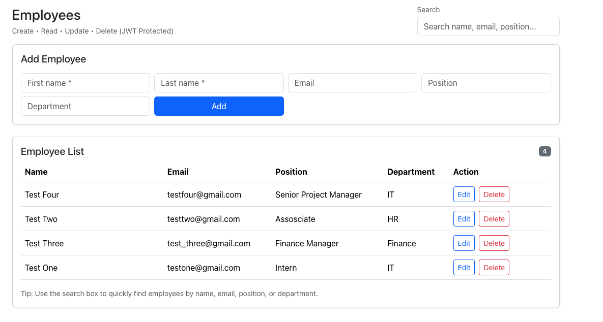

# MERN Employee Management System

## Overview

This project is a **full‑stack MERN application** that demonstrates
secure authentication and protected CRUD operations for managing
employee records.

Users can register, log in securely, and manage employee information
through a web interface. The system uses **JWT authentication** to
protect backend routes and ensure only authorized users can access
employee data.

------------------------------------------------------------------------

# System Architecture

    +-------------+        HTTP Requests        +-------------+
    |             |  Axios / REST API Calls     |             |
    |   React     |  ------------------------->  |   Express   |
    |   Frontend  |                              |   Backend   |
    |             |  <-------------------------  |             |
    +-------------+        JSON Responses       +-------------+
            |                                           |
            |                                           |
            |                                   Mongoose ODM
            |                                           |
            v                                           v
                        +------------------------+
                        |      MongoDB Atlas     |
                        |  Employee & User Data  |
                        +------------------------+

------------------------------------------------------------------------

# Tech Stack

## Frontend

-   React.js
-   Axios
-   Bootstrap

## Backend

-   Node.js
-   Express.js
-   MongoDB Atlas
-   Mongoose
-   JSON Web Tokens (JWT)
-   bcrypt (password hashing)

------------------------------------------------------------------------

# Features

## Authentication

-   User Registration
-   Password hashing using bcrypt
-   Secure login using JWT
-   Protected API routes

## Employee Management

Authenticated users can:

-   Create employee records
-   View employees list
-   Update employee details
-   Delete employee records

## Security

-   JWT authentication middleware
-   Password hashing before storage
-   Protected backend routes

------------------------------------------------------------------------

# Project Structure

    gallium31-mern
    │
    ├── backend
    │   ├── models
    │   │   ├── User.js
    │   │   └── Employee.js
    │   │
    │   ├── routes
    │   │   ├── authRoutes.js
    │   │   └── employeeRoutes.js
    │   │
    │   ├── middleware
    │   │   └── authMiddleware.js
    │   │
    │   ├── server.js
    │   └── package.json
    │
    └── frontend
        ├── src
        │   ├── pages
        │   │   ├── Login.jsx
        │   │   ├── Register.jsx
        │   │   └── Employees.jsx
        │   │
        │   ├── components
        │   │   └── ProtectedRoute.jsx
        │   │
        │   ├── api
        │   │   └── api.js
        │   │
        │   ├── App.js
        │   └── index.js

------------------------------------------------------------------------

# Installation Guide

## Clone Repository

    git clone https://github.com/YOUR_USERNAME/gallium31-mern.git
    cd gallium31-mern

------------------------------------------------------------------------

# Backend Setup

    cd backend
    npm install

Create `.env` file

    PORT=5050
    MONGO_URI=your_mongodb_connection_string
    JWT_SECRET=your_secret_key

Run backend:

    npm run dev

Server runs at:

    http://localhost:5050

------------------------------------------------------------------------

# Frontend Setup

    cd frontend
    npm install
    npm start

Frontend runs at:

    http://localhost:3000

------------------------------------------------------------------------

# API Endpoints

## Authentication

Register user

    POST /api/auth/register

Login user

    POST /api/auth/login

------------------------------------------------------------------------

## Employee CRUD (Protected)

Get employees

    GET /api/employees

Create employee

    POST /api/employees

Update employee

    PUT /api/employees/:id

Delete employee

    DELETE /api/employees/:id

------------------------------------------------------------------------

# Screenshots

### Login Page

### Register Page

![Register Screenshot] (screenshots/register.png) 

### Employee Dashboard

------------------------------------------------------------------------

# Demo Flow

1.  Register a new account
2.  Login using the created credentials
3.  Access the protected employee dashboard
4.  Add a new employee
5.  Edit employee details
6.  Delete employee records

------------------------------------------------------------------------

# Testing

The application was tested using:

-   Postman (API testing)
-   Browser testing for frontend functionality

------------------------------------------------------------------------

# Author

**Sherville Valdez**\
BS Computer Science\
Mapúa University
